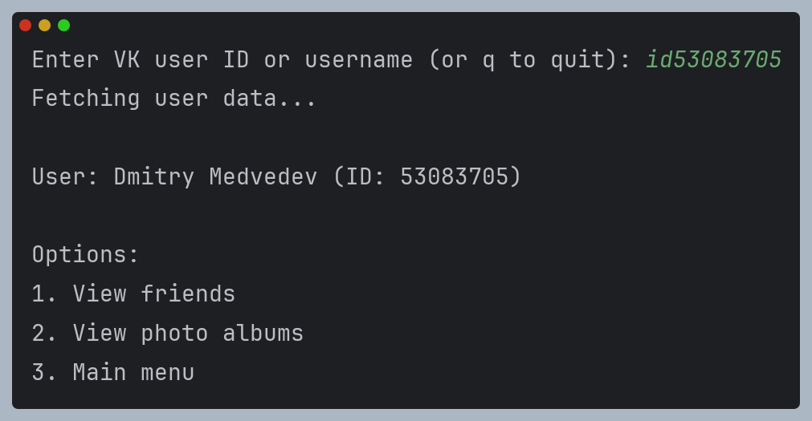
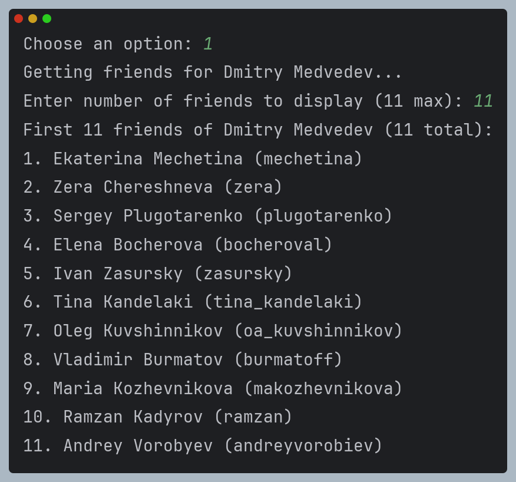
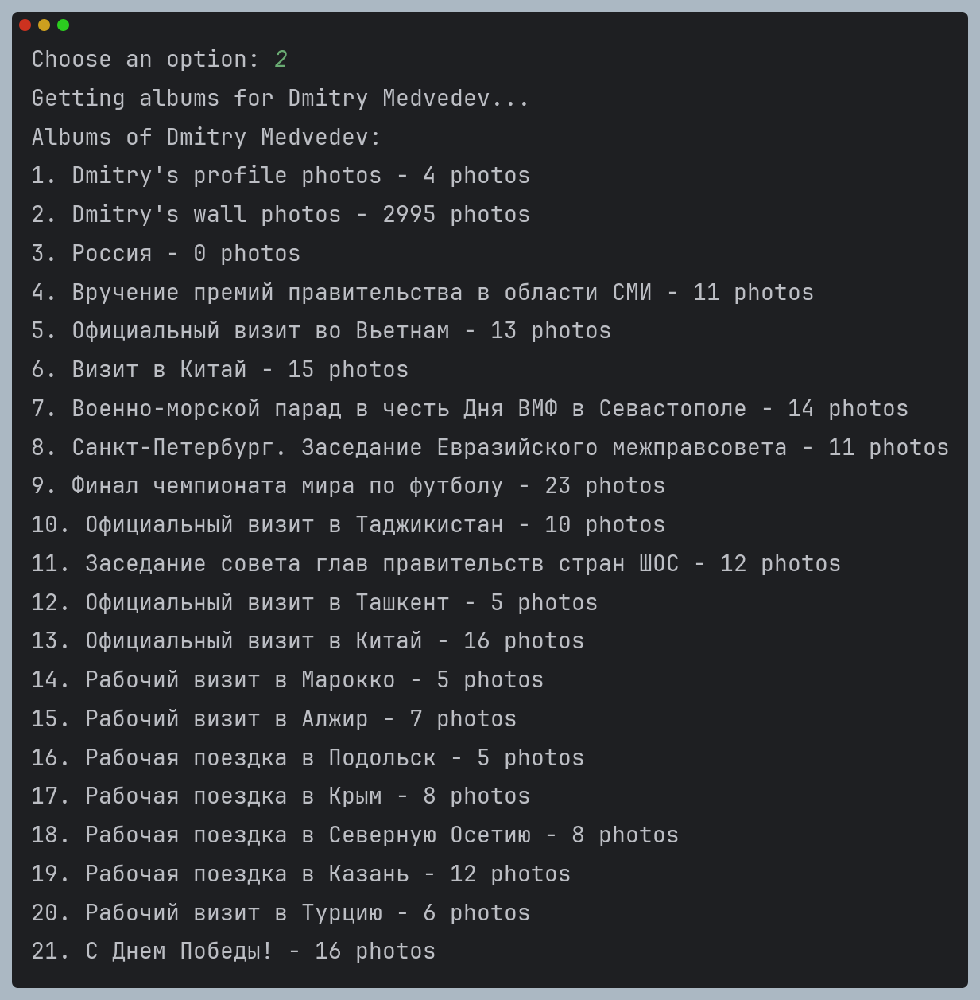
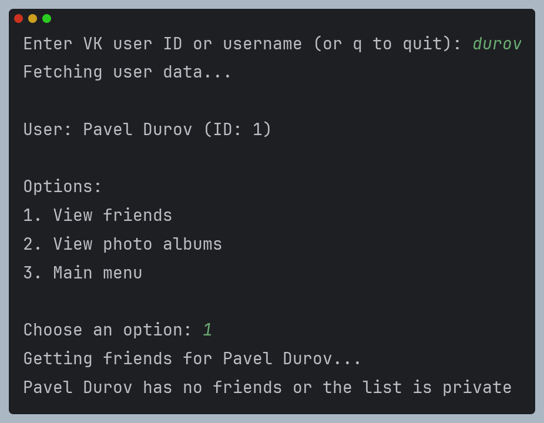

# Получение информации о пользователе с VK API

Данная программа позволяет получать список друзей и список альбомов пользователя через VK API.

## Установка и использование

0. Установите необходимые зависимости: `pip install -r requirements.txt`

1. Запустите программу: `python main.py` или `python3 main.py`

2. Укажите ID или тег пользователя, информацию о котором нужно получить:

3. Выберите необходимую опцию. Например, 1 выведет список друзей (можно указать, сколько выводить):

4. Чтобы вывести список альбомов пользователя, выберите опцию 2:

5. Если список друзей или альбомов недоступен (например, закрытая страница), будет выведено соответствующее сообщение:

